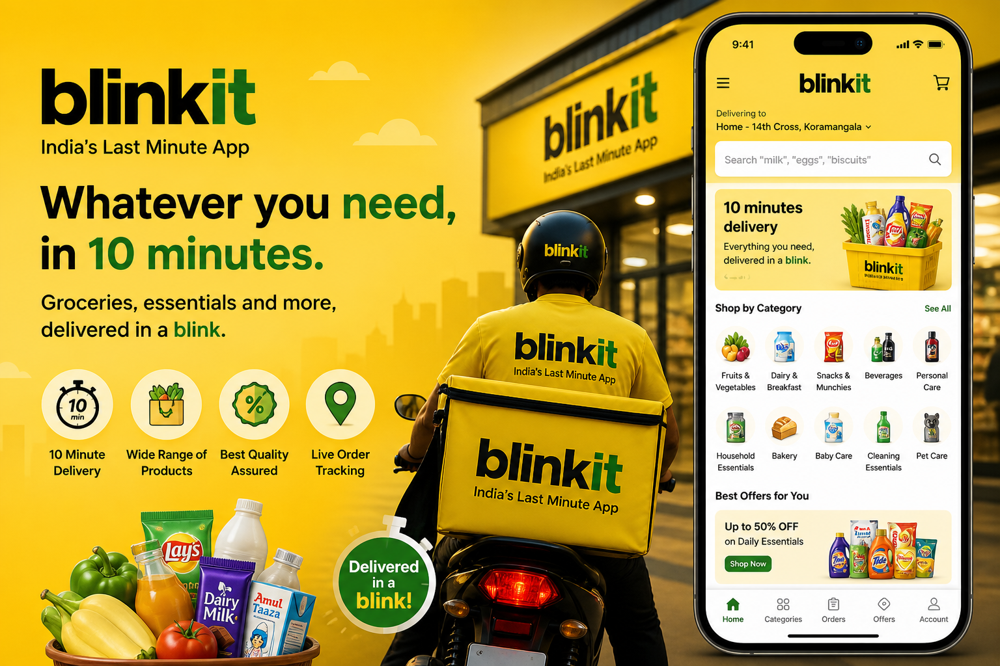
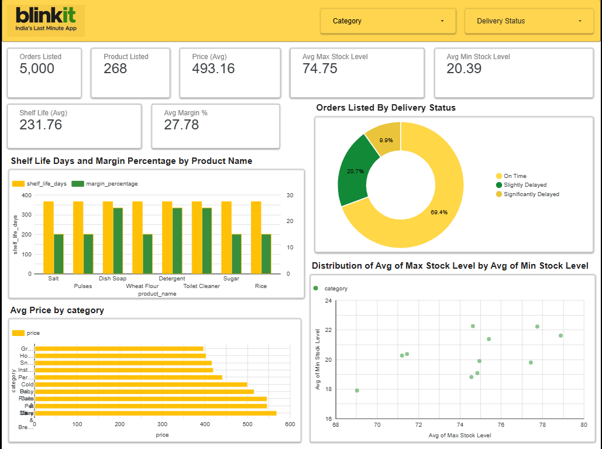
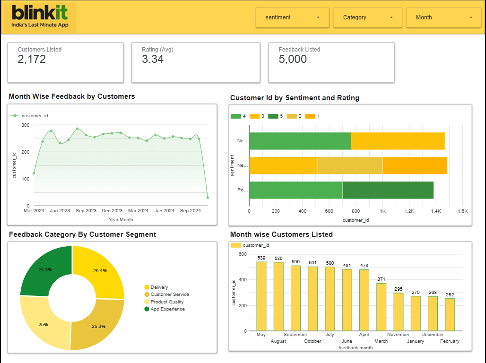

# Blinkit-Analytics-Dashboard

## Project Overview
Blinkit is a leading quick-commerce platform that enables ultra-fast delivery of groceries and daily essentials, typically within minutes. From a data analytics perspective, Blinkit operates on large-scale, real-time data generated from customer orders, product inventory, delivery operations, and marketing campaigns.

In this project, I performed an end-to-end data analytics workflow on Blinkit Sales Data.Using Google Sheets for data preparation and Looker Studio for visualization, I designed an interactive dashboard that highlights key customer behavior, demand patterns, and operational efficiency insights in a clear and intuitive way.

 

## File Details
- **Filename:** `BlinkitSalesDataset`
- **Total Records:** `50000`
- **Primary Keys:** `order_id`,`product_id`,`customer_id`,`campaign_id`,`delivery_partner_id`,`feedback_id`
- **Dashboard:** BlinkitDashboard (pending)

## Tools & Technologies  

- Microsoft Excel  
- Google Sheets  
- Looker Studio/Data Studio

## Data Dictionary  

| Column Name | Description | Data Type |
|------------|------------|----------|
| product_id | Unique identifier for each product | Integer |
| product_name | Name of the product | String |
| category | Product category (e.g., Baby Care, Pet Care, Pharmacy) | String |
| margin_percentage | Profit margin percentage for the product | Float |
| order_id | Unique identifier for each order | Integer |
| customer_id | Unique identifier for each customer | Integer |
| order_date | Date when the order was placed | Date |
| promised_delivery_time | Expected delivery time committed to customer | DateTime |
| actual_delivery_time | Actual delivery time of the order | DateTime |
| order_total | Total value of the order (₹) | Float |
| delivery_partner_id | Unique ID of delivery partner | Integer |
| campaign_id | Identifier for marketing campaign applied | Integer |
| roas | Return on Ad Spend (revenue per ad spend) | Float |
| rating | Customer rating for the order (1–5) | Integer |
| feedback_id | Unique identifier for customer feedback | Integer |
| difference_min | Delivery delay in min | Float |
| impressions | Number of times an ad is displayed to users | Integer |
| clicks | Number of times users clicked on the ad | Integer |
| conversions | Number of desired actions completed (e.g., purchase, signup) after clicking | Integer |

## Data Cleaning Notes  
- Removed duplicate values
- Handled missing or incomplete values
- Standardized product names, city names, and officiating roles
- Verified orders dates, time and month formats
- Ensured logical consistency between marketing campaign performance through ROAS, clicks, and impressions
- Structured categorical fields for better filtering in dashboards

## Product Dashboard  

### A. Key Insights

- Strong operational dataset : 5,000+ orders and 268 products analyzed
- Healthy profitability across products : Average price (493) and margin (27.78%)
- Average shelf life of 231.76 days shows most listed products are non-perishable or slow-expiry inventory items.
- Nearly 69.4% of deliveries are on time, but 30.6% delayed orders highlight a need for delivery speed improvement.
- Only 9.9% significantly delayed deliveries indicate severe SLA breaches are limited but still operationally important.
- Household cleaning products like dish soap, detergent, and toilet cleaner generate higher margins than staple grocery items.
- Staple products such as salt, pulses, rice, and sugar offer lower margins, meaning they drive volume more than profit.
- The average max stock level of 74.75 units suggests Blinkit keeps strong inventory buffers to avoid stockouts.
- The average min stock level of 20.39 units reflects conservative reorder thresholds for continuous product availability.
- The wide gap between max and min stock levels indicates possible overstocking in some product categories.
- Category-wise pricing variation shows that some product segments contribute significantly higher revenue per order.
- The scatter plot reveals inconsistent stock planning across categories, suggesting non-uniform inventory control practices.
- Shelf life remains consistently high across products, but margin percentages vary, showing not all long-life products are equally profitable.

### B. Future Recommendations

- Improve delivery routing to reduce delayed orders.
- Use category-wise stock planning for better inventory control.
- Promote high-margin products to increase profit.
- Use staple items mainly to attract more customers.
- Reduce overstock to save storage cost.
- Apply demand forecasting for smart stock replenishment.
- Track delivery delays by product category.
- Encourage cross-selling to raise order value.
- Monitor old and slow-moving stock regularly.
- Improve dark store efficiency for faster dispatch.
- Use SKU-wise margin analysis in stock decisions.
- Add refund and cancellation tracking in dashboard.
- Follow seasonal demand for stocking products.
- Set alerts for low stock and delayed deliveries.
- Adopt more data-driven inventory management.

## Customer Dashboard 

### A.Key Insights

- Blinkit collected feedback from 2,172 customers with 5,000 total feedback records.
- The average customer rating is 3.34, showing moderate customer satisfaction.
- Customer feedback remained mostly stable across months with slight fluctuations.
- Positive sentiment customers mainly gave higher ratings compared to neutral and negative users.
- Negative and neutral sentiments are still high, indicating improvement areas in service quality.
- Feedback is almost equally distributed across delivery, customer service, product quality, and app experience.
- Delivery received the highest share of customer complaints and suggestions.
- Customer engagement was highest in May and August based on monthly customer count.
- Customer feedback participation dropped in later months, showing reduced engagement.
- Monthly listed customers gradually declined, which may signal lower feedback response rate.
- Customer sentiment analysis shows mixed experiences rather than strongly positive satisfaction.
- Product quality and app experience also contribute significantly to customer opinions.
- The dashboard highlights that customer satisfaction is average, not excellent.
- Blinkit needs to focus more on customer retention and service improvement.

### B. Future Recommendations

- Improve delivery service to reduce customer complaints.
- Enhance customer support for faster issue resolution.
- Focus on improving product quality consistency.
- Upgrade app performance for better user experience.
- Increase average customer rating through service improvements.
- Convert neutral customers into positive customers with better engagement.
- Take quick action on negative feedback areas.
- Encourage more customers to give monthly feedback.
- Launch loyalty offers to improve customer retention.
- Track month-wise sentiment changes regularly.
- Use feedback data for category-wise service planning.
- Strengthen communication with dissatisfied customers.
- Provide personalized offers based on customer reviews.
- Set alerts for rising negative sentiment trends.
- Adopt a customer-centric improvement strategy.

- 

